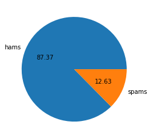
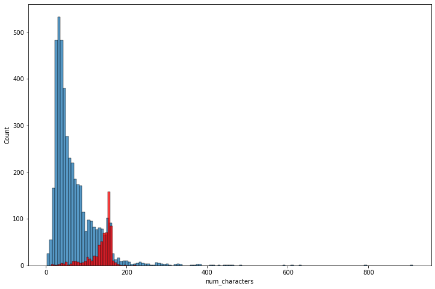
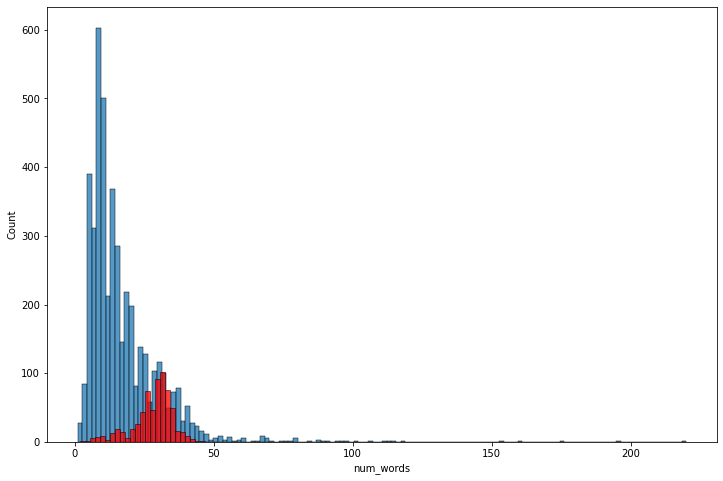
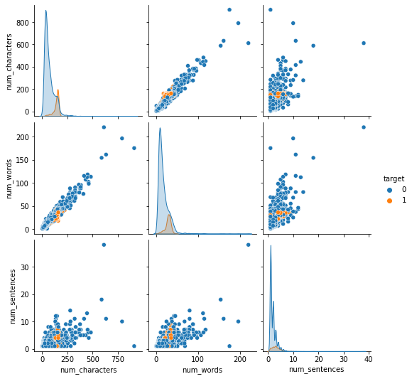
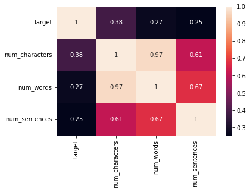
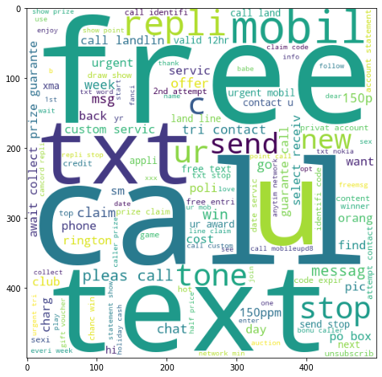
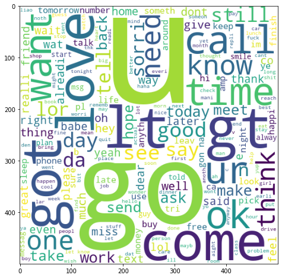
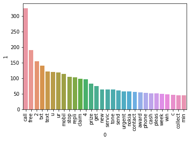
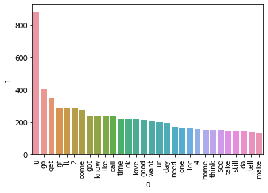
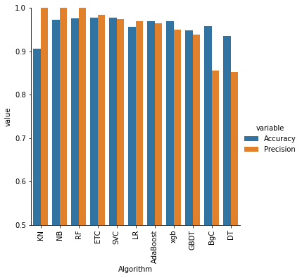

# Email Spam Classifier


import pandas as pd


```python
df = pd.read_csv('spam.csv', encoding= 'ISO-8859-1')
df.sample(5)
```
<table border="1" class="dataframe">
  <thead>
    <tr style="text-align: right;">
      <th></th>
      <th>v1</th>
      <th>v2</th>
      <th>Unnamed: 2</th>
      <th>Unnamed: 3</th>
      <th>Unnamed: 4</th>
    </tr>
  </thead>
  <tbody>
    <tr>
      <th>2543</th>
      <td>ham</td>
      <td>Package all your programs well</td>
      <td>NaN</td>
      <td>NaN</td>
      <td>NaN</td>
    </tr>
    <tr>
      <th>3123</th>
      <td>ham</td>
      <td>My uncles in Atlanta. Wish you guys a great se...</td>
      <td>NaN</td>
      <td>NaN</td>
      <td>NaN</td>
    </tr>
    <tr>
      <th>3779</th>
      <td>ham</td>
      <td>Then ur physics get a-?</td>
      <td>NaN</td>
      <td>NaN</td>
      <td>NaN</td>
    </tr>
    <tr>
      <th>1525</th>
      <td>ham</td>
      <td>Pls pls find out from aunt nike.</td>
      <td>NaN</td>
      <td>NaN</td>
      <td>NaN</td>
    </tr>
    <tr>
      <th>1290</th>
      <td>ham</td>
      <td>Eat jap done oso aft ur lect wat... ?? got lec...</td>
      <td>NaN</td>
      <td>NaN</td>
      <td>NaN</td>
    </tr>
  </tbody>
</table>
</div>


```python
# Steps of sms-spam-detectiion project
# 1. Data Cleaning
# 2. EDA
# 3. Text Preprocessing
# 4. Model Building
# 5. Evaluation
# 6. Improvement
# 7. Website
```

## Data Cleaning


```python
df.info()
```

    <class 'pandas.core.frame.DataFrame'>
    RangeIndex: 5572 entries, 0 to 5571
    Data columns (total 5 columns):
     #   Column      Non-Null Count  Dtype 
    ---  ------      --------------  ----- 
     0   v1          5572 non-null   object
     1   v2          5572 non-null   object
     2   Unnamed: 2  50 non-null     object
     3   Unnamed: 3  12 non-null     object
     4   Unnamed: 4  6 non-null      object
    dtypes: object(5)
    memory usage: 217.8+ KB
    


```python
# drop last 3 columns
df.drop(columns=['Unnamed: 2', 'Unnamed: 3', 'Unnamed: 4'], inplace = True)
```


```python
df.sample(5)
```

<table border="1" class="dataframe">
  <thead>
    <tr style="text-align: right;">
      <th></th>
      <th>v1</th>
      <th>v2</th>
    </tr>
  </thead>
  <tbody>
    <tr>
      <th>2806</th>
      <td>spam</td>
      <td>December only! Had your mobile 11mths+? You ar...</td>
    </tr>
    <tr>
      <th>284</th>
      <td>ham</td>
      <td>Yeah I think my usual guy's still passed out f...</td>
    </tr>
    <tr>
      <th>3616</th>
      <td>ham</td>
      <td>Sorry sent blank msg again. Yup but trying 2 d...</td>
    </tr>
    <tr>
      <th>343</th>
      <td>ham</td>
      <td>Am not interested to do like that.</td>
    </tr>
    <tr>
      <th>3880</th>
      <td>ham</td>
      <td>Can you plz tell me the ans. BSLVYL sent via f...</td>
    </tr>
  </tbody>
</table>


```python
# renaming the columns
df.rename(columns = {'v1': 'target', 'v2': 'text' }, inplace = True)
df.sample(5)
```

<table border="1" class="dataframe">
  <thead>
    <tr style="text-align: right;">
      <th></th>
      <th>target</th>
      <th>text</th>
    </tr>
  </thead>
  <tbody>
    <tr>
      <th>737</th>
      <td>spam</td>
      <td>Hi. Customer Loyalty Offer:The NEW Nokia6650 M...</td>
    </tr>
    <tr>
      <th>5333</th>
      <td>ham</td>
      <td>Neither [in sterm voice] - i'm studying. All f...</td>
    </tr>
    <tr>
      <th>4043</th>
      <td>ham</td>
      <td>Yes, my reg is  Ciao!</td>
    </tr> 
    <tr>
      <th>1242</th>
      <td>ham</td>
      <td>Nobody can decide where to eat and dad wants C...</td>
    </tr>
    <tr>
      <th>16</th>
      <td>ham</td>
      <td>Oh k...i'm watching here:)</td>
    </tr>
  </tbody>
</table>

```python
# assigning 0 to ham and 1 to spam in target column
from sklearn.preprocessing import LabelEncoder
encoder = LabelEncoder()
```


```python
df['target'] = encoder.fit_transform(df['target'])
```


```python
# checking for missing and duplicate values
df.isnull().sum()
df.duplicated().sum()
```


    403


```python
df = df.drop_duplicates(keep = 'first')
df.duplicated().sum()
```


    0


## EDA


```python
# check number of hams and spams in dataset
df['target'].value_counts()
```


    0    4516
    1     653
    Name: target, dtype: int64


```python
# visually seeing the above information, autopct="%0.2f" specifying that we want to see two values after decimal
import matplotlib.pyplot as plt
plt.pie(df['target'].value_counts(), labels = ['hams', 'spams'], autopct="%0.2f")
plt.show()
```


    
 
    


```python
# so the data is imbalanced as 80% of the values are hams and only 12% are spams
```


```python
# creating new 3 columns to see number of characters, words and sentences in the sms column
import nltk
```


```python
# to download some of the libraries that nltk needs
nltk.download('punkt')
```

    [nltk_data] Downloading package punkt to
    [nltk_data]     C:\Users\PAK\AppData\Roaming\nltk_data...
    [nltk_data]   Package punkt is already up-to-date!
    


    True


```python
df['num_characters'] = df['text'].apply(len)
```


```python
df.head(5)
```


<table border="1" class="dataframe">
  <thead>
    <tr style="text-align: right;">
      <th></th>
      <th>target</th>
      <th>text</th>
      <th>num_characters</th>
    </tr>
  </thead>
  <tbody>
    <tr>
      <th>0</th>
      <td>0</td>
      <td>Go until jurong point, crazy.. Available only ...</td>
      <td>111</td>
    </tr>
    <tr>
      <th>1</th>
      <td>0</td>
      <td>Ok lar... Joking wif u oni...</td>
      <td>29</td>
    </tr>
    <tr>
      <th>2</th>
      <td>1</td>
      <td>Free entry in 2 a wkly comp to win FA Cup fina...</td>
      <td>155</td>
    </tr>
    <tr>
      <th>3</th>
      <td>0</td>
      <td>U dun say so early hor... U c already then say...</td>
      <td>49</td>
    </tr>
    <tr>
      <th>4</th>
      <td>0</td>
      <td>Nah I don't think he goes to usf, he lives aro...</td>
      <td>61</td>
    </tr>
  </tbody>
</table>


```python

```


```python
# fetch number of words
df['num_words'] = df['text'].apply(lambda x: len(nltk.word_tokenize(x)))  # converting each string of text into list of words and then counting them
```


```python
df.head(5)
```


<table border="1" class="dataframe">
  <thead>
    <tr style="text-align: right;">
      <th></th>
      <th>target</th>
      <th>text</th>
      <th>num_characters</th>
      <th>num_words</th>
    </tr>
  </thead>
  <tbody>
    <tr>
      <th>0</th>
      <td>0</td>
      <td>Go until jurong point, crazy.. Available only ...</td>
      <td>111</td>
      <td>24</td>
    </tr>
    <tr>
      <th>1</th>
      <td>0</td>
      <td>Ok lar... Joking wif u oni...</td>
      <td>29</td>
      <td>8</td>
    </tr>
    <tr>
      <th>2</th>
      <td>1</td>
      <td>Free entry in 2 a wkly comp to win FA Cup fina...</td>
      <td>155</td>
      <td>37</td>
    </tr>
    <tr>
      <th>3</th>
      <td>0</td>
      <td>U dun say so early hor... U c already then say...</td>
      <td>49</td>
      <td>13</td>
    </tr>
    <tr>
      <th>4</th>
      <td>0</td>
      <td>Nah I don't think he goes to usf, he lives aro...</td>
      <td>61</td>
      <td>15</td>
    </tr>
  </tbody>
</table>


```python
# fetch number of sentences, sent_tokenize break the text on the basis of sentences
df['num_sentences'] = df['text'].apply(lambda x: len(nltk.sent_tokenize(x)))  # converting each string of text into list of words and then counting them
```


```python
df.head(5)
```

<table border="1" class="dataframe">
  <thead>
    <tr style="text-align: right;">
      <th></th>
      <th>target</th>
      <th>text</th>
      <th>num_characters</th>
      <th>num_words</th>
      <th>num_sentences</th>
    </tr>
  </thead>
  <tbody>
    <tr>
      <th>0</th>
      <td>0</td>
      <td>Go until jurong point, crazy.. Available only ...</td>
      <td>111</td>
      <td>24</td>
      <td>2</td>
    </tr>
    <tr>
      <th>1</th>
      <td>0</td>
      <td>Ok lar... Joking wif u oni...</td>
      <td>29</td>
      <td>8</td>
      <td>2</td>
    </tr>
    <tr>
      <th>2</th>
      <td>1</td>
      <td>Free entry in 2 a wkly comp to win FA Cup fina...</td>
      <td>155</td>
      <td>37</td>
      <td>2</td>
    </tr>
    <tr>
      <th>3</th>
      <td>0</td>
      <td>U dun say so early hor... U c already then say...</td>
      <td>49</td>
      <td>13</td>
      <td>1</td>
    </tr>
    <tr>
      <th>4</th>
      <td>0</td>
      <td>Nah I don't think he goes to usf, he lives aro...</td>
      <td>61</td>
      <td>15</td>
      <td>1</td>
    </tr>
  </tbody>
</table>


```python
df[['num_characters', 'num_words', 'num_sentences']].describe()
```


<table border="1" class="dataframe">
  <thead>
    <tr style="text-align: right;">
      <th></th>
      <th>num_characters</th>
      <th>num_words</th>
      <th>num_sentences</th>
    </tr>
  </thead>
  <tbody>
    <tr>
      <th>count</th>
      <td>5169.000000</td>
      <td>5169.000000</td>
      <td>5169.00000</td>
    </tr>
    <tr>
      <th>mean</th>
      <td>78.894177</td>
      <td>18.592571</td>
      <td>2.00503</td>
    </tr>
    <tr>
      <th>std</th>
      <td>58.162207</td>
      <td>13.395103</td>
      <td>1.47554</td>
    </tr>
    <tr>
      <th>min</th>
      <td>2.000000</td>
      <td>1.000000</td>
      <td>1.00000</td>
    </tr>
    <tr>
      <th>25%</th>
      <td>36.000000</td>
      <td>9.000000</td>
      <td>1.00000</td>
    </tr>
    <tr>
      <th>50%</th>
      <td>60.000000</td>
      <td>15.000000</td>
      <td>2.00000</td>
    </tr>
    <tr>
      <th>75%</th>
      <td>116.000000</td>
      <td>26.000000</td>
      <td>3.00000</td>
    </tr>
    <tr>
      <th>max</th>
      <td>910.000000</td>
      <td>220.000000</td>
      <td>38.00000</td>
    </tr>
  </tbody>
</table>


```python
# using describe seperately for ham and spam
# for ham
df[df['target'] == 0][['num_characters', 'num_words', 'num_sentences']].describe()
```

<table border="1" class="dataframe">
  <thead>
    <tr style="text-align: right;">
      <th></th>
      <th>num_characters</th>
      <th>num_words</th>
      <th>num_sentences</th>
    </tr>
  </thead>
  <tbody>
    <tr>
      <th>count</th>
      <td>4516.000000</td>
      <td>4516.000000</td>
      <td>4516.000000</td>
    </tr>
    <tr>
      <th>mean</th>
      <td>70.424048</td>
      <td>17.211470</td>
      <td>1.863375</td>
    </tr>
    <tr>
      <th>std</th>
      <td>56.337668</td>
      <td>13.525179</td>
      <td>1.417710</td>
    </tr>
    <tr>
      <th>min</th>
      <td>2.000000</td>
      <td>1.000000</td>
      <td>1.000000</td>
    </tr>
    <tr>
      <th>25%</th>
      <td>34.000000</td>
      <td>8.000000</td>
      <td>1.000000</td>
    </tr>
    <tr>
      <th>50%</th>
      <td>52.000000</td>
      <td>13.000000</td>
      <td>1.000000</td>
    </tr>
    <tr>
      <th>75%</th>
      <td>90.000000</td>
      <td>22.000000</td>
      <td>2.000000</td>
    </tr>
    <tr>
      <th>max</th>
      <td>910.000000</td>
      <td>220.000000</td>
      <td>38.000000</td>
    </tr>
  </tbody>
</table>


```python
# for spam
df[df['target'] == 1][['num_characters', 'num_words', 'num_sentences']].describe()
```


<table border="1" class="dataframe">
  <thead>
    <tr style="text-align: right;">
      <th></th>
      <th>num_characters</th>
      <th>num_words</th>
      <th>num_sentences</th>
    </tr>
  </thead>
  <tbody>
    <tr>
      <th>count</th>
      <td>653.000000</td>
      <td>653.000000</td>
      <td>653.000000</td>
    </tr>
    <tr>
      <th>mean</th>
      <td>137.471669</td>
      <td>28.143951</td>
      <td>2.984686</td>
    </tr>
    <tr>
      <th>std</th>
      <td>30.019848</td>
      <td>7.132668</td>
      <td>1.496339</td>
    </tr>
    <tr>
      <th>min</th>
      <td>13.000000</td>
      <td>2.000000</td>
      <td>1.000000</td>
    </tr>
    <tr>
      <th>25%</th>
      <td>131.000000</td>
      <td>25.000000</td>
      <td>2.000000</td>
    </tr>
    <tr>
      <th>50%</th>
      <td>148.000000</td>
      <td>29.000000</td>
      <td>3.000000</td>
    </tr>
    <tr>
      <th>75%</th>
      <td>157.000000</td>
      <td>33.000000</td>
      <td>4.000000</td>
    </tr>
    <tr>
      <th>max</th>
      <td>223.000000</td>
      <td>47.000000</td>
      <td>9.000000</td>
    </tr>
  </tbody>
</table>


```python
# seeing the above information in form of histogram
import seaborn as sns
plt.figure(figsize=(12,8))
sns.histplot(df[df['target']==0]['num_characters'])
sns.histplot(df[df['target']==1]['num_characters'], color='red')
```


    <AxesSubplot:xlabel='num_characters', ylabel='Count'>


    

    


```python
# seeing num of words distribution for hams and spams in form of histogram
import seaborn as sns
plt.figure(figsize=(12,8))
sns.histplot(df[df['target']==0]['num_words'])
sns.histplot(df[df['target']==1]['num_words'], color='red')
```


    <AxesSubplot:xlabel='num_words', ylabel='Count'>


    

    


```python
# to see the relationship between number of words and number of sentences
sns.pairplot(df, hue="target")
```


    <seaborn.axisgrid.PairGrid at 0x29c3bb83400>


    

    


```python
# the above analysis does not gave much insight just indicated that there are outliers in the data
# now finding pierson correlation by creating a heatmap
sns.heatmap(df.corr(), annot = True)
```


    <AxesSubplot:>


    

    


```python
# so based on heatmap we can say, num_characters has maximum correlation with target, 
#mean the more character the more target value which means 1
# the num_characters column will be chosen
```

## Data Preprocessing
#### 1. Lower Case
#### 2. Tokenization
#### 3. Removing Special Characters
#### 4. Removing Stop Words and Puntuations
#### 5. Stemming


```python
from nltk.corpus import stopwords
nltk.download('stopwords')
import string     # importing for puctuation
stopwords.words("english")
from nltk.stem.porter import PorterStemmer 
ps = PorterStemmer()
```

    [nltk_data] Downloading package stopwords to
    [nltk_data]     C:\Users\PAK\AppData\Roaming\nltk_data...
    [nltk_data]   Package stopwords is already up-to-date!
    


```python

def transform_text(text):
    text = text.lower()
    text = nltk.word_tokenize(text)

    # removing special characters
    y = []
    for i in text:
        if i.isalnum():
            y.append(i)
            
# removing stop words and punctuation
    text = y[:]    # since we are trying to copy a list so we have to do clonning
    y.clear()
    for i in text:
        if i not in stopwords.words("english") and i not in string.punctuation:
            y.append(i)

    # removing stop words and punctuation
    text = y[:]    # since we are trying to copy a list so we have to do clonning
    y.clear()
    for i in text:
        y.append(ps.stem(i))
    return " ".join(y)    # to return as a string
```


```python
transform_text("Hi HAHF my name is kainat 01$$ dancing")
```


    'hi hahf name kainat 01 danc'


```python
df['transform_text'] = df['text'].apply(transform_text)
```


```python
# to see most used words in ham and spam
from wordcloud import WordCloud
wc = WordCloud(width=500, height = 500, min_font_size = 10, background_color = "white")
```


```python
spam_wc = wc.generate(df[df['target'] == 1]['transform_text'].str.cat(sep = " "))
```


```python
plt.figure(figsize = (15,8))
plt.imshow(spam_wc)
```


    <matplotlib.image.AxesImage at 0x29c3eaba410>


    

    


```python
ham_wc = wc.generate(df[df['target'] == 0]['transform_text'].str.cat(sep = " "))
plt.figure(figsize = (15,8))
plt.imshow(ham_wc)
```


    <matplotlib.image.AxesImage at 0x29c4029ce50>


    

    


```python
# now we are trying to see top 30 words in ham and spam
spam_corpus = []
for msg in df[df['target'] == 1]['transform_text'].tolist():
    for word in msg.split():
        spam_corpus.append(word)
```


```python
len(spam_corpus)
```


    10151


```python
from collections import Counter
sns.barplot(x=pd.DataFrame(Counter(spam_corpus).most_common(30))[0],y=pd.DataFrame(Counter(spam_corpus).most_common(30))[1])
plt.xticks(rotation='vertical')
plt.show()
```


    

    


```python
ham_corpus = []
for msg in df[df['target'] == 0]['transform_text'].tolist():
    for word in msg.split():
        ham_corpus.append(word)
```


```python
sns.barplot(x=pd.DataFrame(Counter(ham_corpus).most_common(30))[0],y=pd.DataFrame(Counter(ham_corpus).most_common(30))[1])
plt.xticks(rotation='vertical')
plt.show()
```


    

    


## Model Building


```python
from sklearn.feature_extraction.text import CountVectorizer, TfidfVectorizer
cv = CountVectorizer()
tfidf = TfidfVectorizer(max_features=3000)
X = tfidf.fit_transform(df['transform_text']).toarray()
```


```python
X.shape
```


    (5169, 3000)


```python
y = df['target'].values
```


```python
from sklearn.model_selection import train_test_split
```


```python
X_train, X_test, y_train, y_test = train_test_split(X,y, test_size=0.2, random_state=2)
```


```python
from sklearn.naive_bayes import GaussianNB, MultinomialNB, BernoulliNB
from sklearn.metrics import accuracy_score, confusion_matrix, precision_score
```


```python
gnb = GaussianNB()
mnb = MultinomialNB()
bnb = BernoulliNB()
```


```python
gnb.fit(X_train,y_train)
y_pred1 = gnb.predict(X_test)
print(accuracy_score(y_test,y_pred1))
print(confusion_matrix(y_test,y_pred1))
print(precision_score(y_test,y_pred1))
```

    0.8704061895551257
    [[786 110]
     [ 24 114]]
    0.5089285714285714
    


```python
mnb.fit(X_train,y_train)
y_pred2 = mnb.predict(X_test)
print(accuracy_score(y_test,y_pred2))
print(confusion_matrix(y_test,y_pred2))
print(precision_score(y_test,y_pred2))
```

    0.9729206963249516
    [[896   0]
     [ 28 110]]
    1.0
    


```python
bnb.fit(X_train,y_train)
y_pred3 = bnb.predict(X_test)
print(accuracy_score(y_test,y_pred3))
print(confusion_matrix(y_test,y_pred3))
print(precision_score(y_test,y_pred3))
```

    0.9816247582205029
    [[895   1]
     [ 18 120]]
    0.9917355371900827
    


```python
 # so we are choosing tfidf --> mnb because data is imbalanced so precision is more important than accuracy 
# tfidf --> mnb is giving 100% precision
```


```python
from sklearn.svm import SVC
from sklearn.neighbors import KNeighborsClassifier
from sklearn.tree import DecisionTreeClassifier
from sklearn.linear_model import LogisticRegression
from sklearn.ensemble import RandomForestClassifier
from sklearn.ensemble import AdaBoostClassifier
from sklearn.ensemble import BaggingClassifier
from sklearn.ensemble import ExtraTreesClassifier
from sklearn.ensemble import GradientBoostingClassifier
from xgboost import XGBClassifier

```


```python
svc = SVC(kernel='sigmoid', gamma=1.0)
knc = KNeighborsClassifier()
dtc = DecisionTreeClassifier(max_depth=5)
lrc = LogisticRegression(solver = 'liblinear', penalty='l1')
rfc = RandomForestClassifier(n_estimators = 50, random_state=2)
abc = AdaBoostClassifier(n_estimators = 50, random_state=2)
bc = BaggingClassifier(n_estimators = 50, random_state=2)
etc = ExtraTreesClassifier(n_estimators = 50, random_state=2)
gbdt = GradientBoostingClassifier(n_estimators = 50, random_state=2)
xgb = XGBClassifier(n_estimators = 50, random_state=2)
```


```python
clfs = {
    'SVC' : svc,
    'KN' : knc,
    'NB' : mnb,
    'DT' : dtc,
    'LR' : lrc,
    'RF' : rfc,
    'AdaBoost' : abc,
    'BgC' : bc,
    'ETC' : etc,
    'GBDT' : gbdt,
    'xgb' : xgb
}
```


```python
def train_classifier(clf,X_train,y_train,X_test,y_test):
    clf.fit(X_train,y_train)
    y_pred = clf.predict(X_test)
    accuracy = accuracy_score(y_test, y_pred)
    precision = precision_score(y_test, y_pred)

    return accuracy, precision
```


```python
train_classifier(svc, X_train, y_train, X_test, y_test)

```


    (0.97678916827853, 0.975)


```python
accuracy_scores = []
precision_scores = []
for name,clf in clfs.items():
    current_accuracy, current_precision = train_classifier(clf, X_train, y_train, X_test, y_test)
    print("For ", name)
    print("Acuuracy", current_accuracy)
    print("Precision", current_precision)
    accuracy_scores.append(current_accuracy)
    precision_scores.append(current_precision)
```

    For  SVC
    Acuuracy 0.97678916827853
    Precision 0.975
    For  KN
    Acuuracy 0.9052224371373307
    Precision 1.0
    For  NB
    Acuuracy 0.9729206963249516
    Precision 1.0
    For  DT
    Acuuracy 0.9352030947775629
    Precision 0.8514851485148515
    For  LR
    Acuuracy 0.9564796905222437
    Precision 0.9696969696969697
    For  RF
    Acuuracy 0.9758220502901354
    Precision 1.0
    

    C:\Users\PAK\AppData\Local\Programs\Python\Python310\lib\site-packages\sklearn\ensemble\_weight_boosting.py:519: FutureWarning: The SAMME.R algorithm (the default) is deprecated and will be removed in 1.6. Use the SAMME algorithm to circumvent this warning.
      warnings.warn(
    

    For  AdaBoost
    Acuuracy 0.9690522243713733
    Precision 0.9649122807017544
    For  BgC
    Acuuracy 0.9574468085106383
    Precision 0.8560606060606061
    For  ETC
    Acuuracy 0.9777562862669246
    Precision 0.9831932773109243
    For  GBDT
    Acuuracy 0.9487427466150871
    Precision 0.9381443298969072
    For  xgb
    Acuuracy 0.9700193423597679
    Precision 0.9495798319327731
    


```python
 performance_df = pd.DataFrame({'Algorithm':clfs.keys(), 'Accuracy': accuracy_scores, 'Precision': precision_scores}).sort_values('Precision', ascending=False)
performance_df
```


<table border="1" class="dataframe">
  <thead>
    <tr style="text-align: right;">
      <th></th>
      <th>Algorithm</th>
      <th>Accuracy</th>
      <th>Precision</th>
    </tr>
  </thead>
  <tbody>
    <tr>
      <th>1</th>
      <td>KN</td>
      <td>0.905222</td>
      <td>1.000000</td>
    </tr>
    <tr>
      <th>2</th>
      <td>NB</td>
      <td>0.972921</td>
      <td>1.000000</td>
    </tr>
    <tr>
      <th>5</th>
      <td>RF</td>
      <td>0.975822</td>
      <td>1.000000</td>
    </tr>
    <tr>
      <th>8</th>
      <td>ETC</td>
      <td>0.977756</td>
      <td>0.983193</td>
    </tr>
    <tr>
      <th>0</th>
      <td>SVC</td>
      <td>0.976789</td>
      <td>0.975000</td>
    </tr>
    <tr>
      <th>4</th>
      <td>LR</td>
      <td>0.956480</td>
      <td>0.969697</td>
    </tr>
    <tr>
      <th>6</th>
      <td>AdaBoost</td>
      <td>0.969052</td>
      <td>0.964912</td>
    </tr>
    <tr>
      <th>10</th>
      <td>xgb</td>
      <td>0.970019</td>
      <td>0.949580</td>
    </tr>
    <tr>
      <th>9</th>
      <td>GBDT</td>
      <td>0.948743</td>
      <td>0.938144</td>
    </tr>
    <tr>
      <th>7</th>
      <td>BgC</td>
      <td>0.957447</td>
      <td>0.856061</td>
    </tr>
    <tr>
      <th>3</th>
      <td>DT</td>
      <td>0.935203</td>
      <td>0.851485</td>
    </tr>
  </tbody>
</table>
</div>


```python
performance_df1 = pd.melt(performance_df, id_vars="Algorithm")
```


```python
sns.catplot(x='Algorithm', y='value', hue='variable', data=performance_df1, kind='bar', height=5)
plt.ylim(0.5,1.0)
plt.xticks(rotation='vertical')
plt.show()
```


    

    


```python
# model improvement
# 1. Change the max_features parameter of Tfidf to 3000 and run above code again as a result NB accuracy increased from 95% to 97%
```


```python
import pickle
pickle.dump(tfidf, open('vectorizer.pkl','wb'))
pickle.dump(mnb, open('model.pkl','wb'))
```


```python

```
